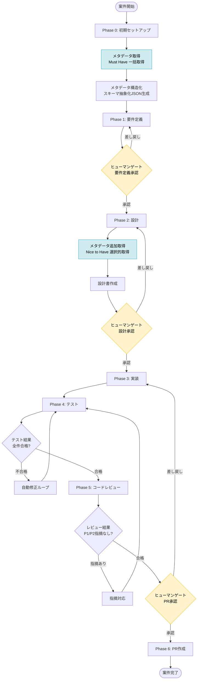
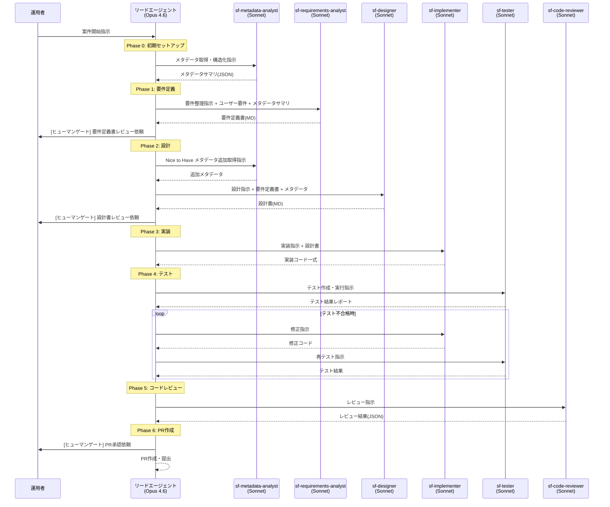

# 01. 全体アーキテクチャ設計（Copilot CLI版）

> Salesforce マルチエージェント開発プロセスフレームワーク

---

## 1. 開発プロセスの全体フロー

### 1.1 フロー概要図



### 1.2 サブエージェント呼び出しフロー



### 1.3 フェーズ定義

| フェーズ | 担当サブエージェント | エントリー条件 | 完了条件 | 主な成果物 |
|---------|-------------------|--------------|---------|-----------|
| Phase 0: 初期セットアップ | `sf-metadata-analyst` | Salesforce組織への認証完了、sfdx-project.json存在 | Must Haveメタデータの構造化JSON生成完了 | `metadata-catalog/schema/`, `metadata-catalog/catalog/` |
| Phase 1: 要件定義 | `sf-requirements-analyst` | メタデータサマリ生成済み、ユーザー要件の入力あり | 要件定義書の全セクション記入完了 | `docs/projects/{PID}/requirements/` |
| Phase 2: 設計 | `sf-designer`, `sf-metadata-analyst` | 要件定義書の承認済み | 設計書の全セクション記入完了、Nice to Haveメタデータ取得済み | `docs/projects/{PID}/design/` |
| Phase 3: 実装 | `sf-implementer` | 設計書の承認済み | 全ファイルの実装完了、ローカルコンパイルエラーなし | Apex/LWC/Flowファイル群 |
| Phase 4: テスト | `sf-tester` | 実装コード一式が存在 | テスト全件合格、カバレッジ75%以上、静的解析スクリプト実行済み | テストクラス、`docs/projects/{PID}/test-results/` |
| Phase 5: コードレビュー | `sf-code-reviewer` | テスト合格済み | P1/P2指摘が0件 | `docs/projects/{PID}/review/` |
| Phase 6: PR作成 | リードエージェント | レビュー合格済み | PRが作成・提出完了 | GitHub Pull Request |

### 1.4 ヒューマンゲートの設計

ヒューマンゲート（人間承認ポイント）は以下の3箇所に設置し、案件設定ファイルで個別に有効/無効を切り替えられる。

**挿入ポイント:**

| ゲートID | タイミング | デフォルト | 推奨設定 |
|---------|-----------|----------|---------|
| `gate_requirements` | Phase 1完了後（要件定義承認） | 有効 | 常に有効（要件の誤りは後工程で修正コストが増大） |
| `gate_design` | Phase 2完了後（設計承認） | 有効 | 新規開発は有効、軽微な修正は無効 |
| `gate_test` | Phase 4完了後（テスト結果承認） | 有効 | 新規開発は有効、テスト結果の妥当性を確認 |
| `gate_pr` | Phase 5完了後（PR承認） | 有効 | 常に有効（本番デプロイ前の最終チェック） |

**設定方法（案件設定ファイル内）:**

```json
// docs/projects/{PROJECT_ID}/project-config.json 内
"humanGates": {
  "gate_requirements": true,
  "gate_design": true,
  "gate_test": true,
  "gate_pr": true
}
```

リードエージェントは以下のコマンドでゲート設定を確認する:

```bash
jq -r '.humanGates.gate_requirements' docs/projects/${PROJECT_ID}/project-config.json
```

> **注記**: ゲート設定は `docs/projects/{PROJECT_ID}/project-config.json` の `humanGates` セクションに統一する。`.github/projects/{PROJECT_ID}/config.yaml` には `human_gates` を記載しない。

**ゲート無効時の動作:** ゲートが無効の場合、リードエージェントは中間成果物をファイル出力した上で自動的に次フェーズへ進む。成果物は事後レビュー用に必ず保存される。

#### 実装方式

ヒューマンゲートは、Copilot CLIの対話的セッション内でメインエージェントが以下のロジックで制御する。Copilot CLIには「自動一時停止」の機能はないため、リードエージェントのプロンプト内で条件分岐を実現する。

**制御フロー:**

```
フェーズN完了
  │
  ├─ 成果物をファイルに出力（必須）
  │
  ├─ project-config.json の対応フェーズを "completed" に更新
  │
  ├─ project-config.json の humanGates 設定を読み取り
  │
  ├─ 該当ゲートが true の場合:
  │   ├─ 成果物の概要サマリを会話に出力
  │   ├─ 確認すべきポイントを箇条書きで提示
  │   ├─ 「承認」「差し戻し」「修正指示」のいずれかの応答を要求
  │   └─ 人間の応答を待機（次のメッセージが来るまで処理を進めない）
  │
  └─ 該当ゲートが false の場合:
      ├─ 「ゲート無効のため自動進行します」をログに出力
      └─ 次フェーズへ直接遷移
```

**「待機」の実現方法:**

Copilot CLIはターン制の対話であるため、メインエージェントがメッセージを出力した時点で自然にターンが終了する。人間がCopilot CLI上で次のメッセージ（承認/差し戻し）を入力するまで処理は進まない。つまり、特別な「一時停止」機構は不要であり、メインエージェントが「承認を待っています」というメッセージで応答を終えれば、それ自体がゲートとして機能する。

**応答の解釈ルール:**

| 入力パターン | 解釈 | アクション |
|---|---|---|
| 「承認」「OK」「approve」「進めて」「LGTM」 | 承認 | 次フェーズに進行 |
| 「差し戻し」「reject」「やり直し」+ 修正指示 | 差し戻し | 修正指示に基づき当該フェーズを再実行 |
| 「中断」「stop」「待って」 | 中断 | 処理を停止し、再開指示を待つ |
| 上記に該当しない入力 | 不明 | 「承認・差し戻し・中断のいずれかで応答してください」と再度要求 |

**重要な制約:**

- ゲートが `true` の場合、**人間の明示的な承認なしに次フェーズに進んではならない**
- ゲート待機中に「おそらく問題ないので進めます」等の自己判断による進行は禁止
- ゲート設定ファイルの読み取りに失敗した場合は、ゲート有効（`true`）として扱う（フェイルセーフ）

### 1.5 メタデータ取得タイミング

```mermaid
gantt
    title メタデータ取得タイミング
    dateFormat X
    axisFormat %s

    section Must Have
    CustomObject/CustomField     :must1, 0, 1
    ApexClass/ApexTrigger        :must2, 0, 1
    Flow/FlowDefinition          :must3, 0, 1
    ValidationRule               :must4, 0, 1
    Profile/PermissionSet        :must5, 0, 1
    PageLayout                   :must6, 0, 1
    LWC                          :must7, 0, 1
    RecordType                   :must8, 0, 1
    PicklistValue/GlobalValueSet :must9, 0, 1
    package.xml/sfdx-project.json:must10, 0, 1

    section Nice to Have（要件依存で選択取得）
    CustomMetadataType/Setting   :nice1, 2, 3
    CustomLabel                  :nice2, 2, 3
    FlexiPage                    :nice3, 2, 3
    SharingRule                  :nice4, 2, 3
    ExistingTestClass            :nice5, 2, 3
    その他（要件に応じて）         :nice6, 2, 3
```



| 取得タイミング | 対象 | トリガー | 実行主体 |
|--------------|------|---------|---------|
| Phase 0（初期） | Must Have全量 | 案件開始時に自動実行 | `sf-metadata-analyst` |
| Phase 2（設計） | Nice to Haveから選択 | 要件分析結果に基づきリードエージェントが判断 | `sf-metadata-analyst` |
| 差分更新 | 変更分のみ | `sf project retrieve start` + Git diff | `sf-metadata-analyst` |

---

## 2. ディレクトリ構成

### 2.1 プロジェクト全体構成

```
project-root/
├── .github/
│   ├── agents/                          # サブエージェント定義（ロール・手順特化）
│   │   ├── sf-metadata-analyst.agent.md
│   │   ├── sf-requirements-analyst.agent.md
│   │   ├── sf-designer.agent.md
│   │   ├── sf-implementer.agent.md
│   │   ├── sf-tester.agent.md
│   │   └── sf-code-reviewer.agent.md
│   │
│   ├── instructions/                           # 条件付き自動適用ルール
│   │   ├── apex-coding.md               # *.cls, *.trigger 作業時に適用
│   │   ├── lwc-coding.md                # lwc/ 配下作業時に適用
│   │   ├── test-coding.md               # *Test.cls 作業時に適用
│   │   ├── commit-rules.md              # コミット操作時に適用
│   │   └── review-rules.md              # レビュー作業時に適用
│   │
│   ├── skills/                          # 詳細ドメイン知識（遅延ロード）
│   │   ├── salesforce-governor-limits/
│   │   │   ├── SKILL.md                 # 判断フロー・検査スクリプト使用法
│   │   │   ├── reference/               # 詳細リファレンス
│   │   │   │   ├── sync-limits.md
│   │   │   │   └── async-limits.md
│   │   │   └── scripts/                 # 静的検査スクリプト
│   │   │       └── scan-governor-violations.sh
│   │   ├── salesforce-fls-security/
│   │   │   ├── SKILL.md
│   │   │   ├── reference/
│   │   │   │   └── fls-patterns.md
│   │   │   └── scripts/
│   │   │       └── scan-fls-compliance.sh
│   │   ├── salesforce-bulk-patterns/
│   │   │   ├── SKILL.md
│   │   │   └── reference/
│   │   │       └── bulk-code-examples.md
│   │   ├── salesforce-lwc-patterns/
│   │   │   ├── SKILL.md
│   │   │   └── reference/
│   │   │       └── lwc-code-examples.md
│   │   └── salesforce-test-patterns/
│   │       ├── SKILL.md
│   │       └── reference/
│   │           └── test-code-examples.md
│   │
│   ├── settings.json                    # パーミッション・環境変数
│   └── projects/                        # 案件別設定
│       └── {PROJECT_ID}/
│           └── config.yaml              # 案件固有設定（ヒューマンゲート等）
│
├── AGENTS.md                            # プロジェクト概要・最小限の共通方針
│
├── force-app/
│   ├── AGENTS.md                        # Salesforce開発固有ルール
│   └── main/default/
│       ├── classes/                      # Apex クラス
│       ├── triggers/                     # Apex トリガ
│       ├── lwc/                          # Lightning Web Components
│       ├── flows/                        # Flow定義
│       ├── objects/                      # オブジェクト定義
│       ├── permissionsets/              # 権限セット
│       └── layouts/                     # ページレイアウト
│
├── metadata-catalog/                    # メタデータカタログ（組織ベースライン・全案件共通）
│   ├── schema/
│   │   ├── objects/                     # オブジェクト単位JSON
│   │   │   ├── Account.json
│   │   │   ├── Opportunity.json
│   │   │   └── ...
│   │   ├── relationships.json           # リレーションマップ
│   │   └── schema_summary.json          # 全体統計
│   │
│   ├── catalog/
│   │   ├── object_dictionary.json       # オブジェクト辞書
│   │   ├── field_dictionary.json        # 項目辞書
│   │   ├── automation_inventory.json    # 自動化ロジック一覧
│   │   ├── permission_matrix.json       # 権限マトリクス
│   │   └── glossary.json                # 業務用語グロサリー
│   │
│   └── scripts/                         # カタログ生成・更新スクリプト
│       ├── extract_schema.sh
│       ├── build_catalog.sh
│       └── validate.sh
│
├── docs/
│   ├── architecture/                    # システムレベル（全案件共通・不変）
│   │   ├── system-context.md            # システムコンテキスト図・連携マップ
│   │   ├── decisions/                   # ADR（Architecture Decision Records）
│   │   │   ├── _template.md
│   │   │   └── ADR-001_xxx.md
│   │   └── policies/                    # 横断的方針
│   │       ├── integration-policy.md
│   │       ├── security-policy.md
│   │       ├── performance-policy.md
│   │       ├── error-handling-policy.md
│   │       └── naming-convention-policy.md
│   │
│   └── projects/                        # 案件別ドキュメント（案件数分増加）
│       ├── index.json                   # 全案件の一覧・ステータス
│       └── {PROJECT_ID}/
│           ├── project-config.json      # 案件設定・ステータス追跡
│           ├── requirements/
│           │   ├── user_requirements.md         # ユーザー要件書（インプット）
│           │   └── requirements_specification.md # 要件定義書（エージェント出力）
│           ├── design/
│           │   ├── data_model_design.md
│           │   ├── apex_design.md
│           │   ├── lwc_design.md               # （該当する場合）
│           │   ├── flow_design.md              # （該当する場合）
│           │   └── implementation_plan.md
│           ├── test-results/
│           │   └── test_report.md
│           └── review/
│               ├── review_report.json
│               ├── review_report.md
│               └── pr_description.md
│
├── scripts/                             # 運用スクリプト
│   ├── setup-project.sh
│   ├── run-pipeline.sh
│   ├── update-phase.sh
│   └── list-projects.sh
│
├── sfdx-project.json
├── package.xml
└── .gitignore
```

**ディレクトリ分類の原則:**

| 分類 | パス | ライフサイクル | 説明 |
|------|------|-------------|------|
| 組織共通（不変） | `docs/architecture/` | 組織と同じ寿命 | システムコンテキスト図、ADR、横断的方針 |
| 組織共通（自動更新） | `metadata-catalog/` | 定期的に差分更新 | メタデータの構造化ベースライン |
| フレームワーク構成 | `.github/agents/`, `.github/instructions/`, `.github/skills/` | フレームワーク改善時に更新 | サブエージェント定義、条件付きルール、Skills |
| 案件別 | `docs/projects/{PROJECT_ID}/` | 案件開始〜PR マージ | 要件・設計・テスト・レビューの全成果物 |
| ソースコード | `force-app/` | 継続的に蓄積 | 全案件の実装コードが蓄積される |

### 2.2 metadata-catalog/ と docs/architecture/ の役割分担

| 観点 | metadata-catalog/ | docs/architecture/ |
|------|-------------------|-------------------|
| **性質** | 機械生成・自動更新（sf-metadata-analyst が生成） | 人間が記述・レビュー |
| **内容** | What（何があるか）— オブジェクト構造、項目定義、自動化一覧 | Why（なぜそうなっているか）・How（全体像）— 設計判断、連携マップ、横断的方針 |
| **更新頻度** | 案件ごと（Phase 0で自動再取得） | 重要な設計判断があった時 |
| **主な利用者** | サブエージェント（設計・実装・レビュー） | サブエージェント + 人間チーム |
| **例** | Account オブジェクトの項目一覧（JSON） | なぜ Account に Score を持たせ Opportunity 側に持たせないか（ADR） |

### 2.3 知識配置のレイヤー設計

サブエージェントの独立コンテキスト特性を考慮し、知識を4つのレイヤーに分散配置する。各レイヤーのロード特性が異なるため、「いつ・誰が・どの知識を必要とするか」に基づいて配置先を決定する。

| レイヤー | 配置先 | ロードタイミング | 誰が読むか | コンテキストコスト | 配置すべき内容 |
|---------|--------|----------------|-----------|-----------------|--------------|
| L1: 常時共通 | `AGENTS.md`（ルート） | 常時 | リード＋全サブエージェント | **高**（常に消費） | プロジェクト概要、サブエージェント利用ガイドライン、メタデータ参照方法 |
| L2: 条件付き自動適用 | `.github/instructions/` | ファイルパターン/条件マッチ時 | 条件に該当するエージェント | **低**（必要時のみ） | Apex規約、LWC規約、テスト規約、コミット規約、レビュー基準 |
| L3: エージェント固有 | `.github/agents/` | サブエージェント呼び出し時 | 該当サブエージェントのみ | **中**（呼び出し時のみ） | ロール定義、入出力フォーマット、フェーズ固有の手順 |
| L4: 詳細知識（遅延） | `.github/skills/` | descriptionマッチ時 | マッチしたエージェント | **最低**（必要時のみ） | 判断フロー、コード例、検査スクリプト、詳細リファレンス |

**配置判断のフローチャート:**

```
この知識は全フェーズ・全エージェントで必要か？
├─ Yes → L1: AGENTS.md（プロジェクト概要、プロセス規約）
└─ No → 特定のファイル種別の作業時のみ必要か？
    ├─ Yes → L2: instructions/（Apexルール、LWCルール等）
    └─ No → 特定のサブエージェントのみ必要か？
        ├─ Yes → L3: agents/（ロール定義、入出力仕様）
        └─ No → 詳細なパターンやコード例か？
            └─ Yes → L4: skills/（判断フロー、検査スクリプト）
```

### 2.4 AGENTS.md 階層設計

AGENTS.mdは2階層で構成するが、**コンテキストコストが最も高い（常時ロード）**ため、内容を最小限に絞る。詳細なコーディングルールはinstructions/に移動し、必要時のみロードされるようにする。

**プロジェクトルート `AGENTS.md`（全エージェント共通 — 軽量化必須）:**

| セクション | 内容 | 注記 |
|-----------|------|------|
| プロジェクト概要 | 案件名、対象組織、開発範囲 | 最小限の情報のみ |
| サブエージェント利用ガイドライン | 各エージェントの役割と呼び出し順序 | フェーズ定義への参照 |
| メタデータカタログ参照方法 | `metadata-catalog/` の場所と利用手順 | |
| アーキテクチャドキュメント参照方法 | `docs/architecture/` の場所と利用手順 | |
| コミット規約 | メッセージフォーマット、粒度 | instructions/へ移動も検討可 |
| 禁止事項 | 本番組織への直接デプロイ禁止等 | |

※ ガバナ制限値、FLSルール、命名規約、コーディング規約は **AGENTS.md には記載しない**。これらは `.github/instructions/` に配置し、該当ファイル作業時にのみ自動適用される。

**`force-app/AGENTS.md`（Salesforce開発固有 — アーキテクチャ原則のみ）:**

| セクション | 内容 | 注記 |
|-----------|------|------|
| レイヤー分離 | Selector/Service/Domain/Controller の責務定義 | 構造的な設計原則のみ |
| トリガフレームワーク | 1オブジェクト1トリガ、Handler委譲 | |
| メタデータ操作規約 | `sf` コマンド（v2）の使用方法 | |

※ 具体的なコーディング規約（命名規約、禁止パターン、ガバナ制限遵守ルール等）は `.github/instructions/apex-coding.md` 等に配置。

### 2.5 instructions/ — 条件付き自動適用Instructions

`.github/instructions/` にはファイルパターンや作業コンテキストに応じて自動適用されるルールを配置する。AGENTS.mdと異なり、**条件にマッチしたときのみロードされる**ため、コンテキストコストを抑えながら詳細なルールを提供できる。

| ルールファイル | 適用条件 | 主な内容 |
|--------------|---------|---------|
| `apex-coding.md` | `*.cls`, `*.trigger` ファイルの作業時 | ガバナ制限の具体値、FLS必須ルール、バルク化原則、命名規約、禁止パターン |
| `lwc-coding.md` | `force-app/**/lwc/**` 配下の作業時 | Wire優先、SLDS準拠、イベント設計、アクセシビリティ |
| `test-coding.md` | `*Test.cls` ファイルの作業時 | @TestSetup必須、SeeAllData禁止、TestDataFactory、カバレッジ基準 |
| `commit-rules.md` | コミット操作時 | メッセージフォーマット、粒度ルール |
| `review-rules.md` | レビュー作業時 | Severity定義（P1-P4）、ゲート通過条件、チェックリスト |

**instructions/ の設計原則:**

1. **1ルールファイル = 1関心事**: Apex規約とLWC規約は分離する。混在させない
2. **具体的な値を含める**: ガバナ制限値（SOQL 100回等）はinstructions/に記載する（AGENTS.mdには書かない）
3. **globs/description の明記**: 各ルールファイルのfrontmatterに適用条件を明確に記述する
4. **サブエージェントへの自動適用**: サブエージェントが該当ファイルを操作すると自動的にルールが適用される

### 2.6 サブエージェント定義ファイル配置

`.github/agents/` 配下に6つのMarkdownファイルを配置する。各ファイルはYAML frontmatter + システムプロンプトの構成とする。

| ファイル名 | 役割 | モデル | 許可ツール |
|-----------|------|--------|-----------|
| `sf-metadata-analyst.md` | メタデータ取得・構造化 | Sonnet | Read, Bash, Grep, Glob |
| `sf-requirements-analyst.md` | 要件定義 | Sonnet | Read, Grep, Glob |
| `sf-designer.md` | 設計 | Sonnet | Read, Grep, Glob |
| `sf-implementer.md` | 実装 | Sonnet | Read, Edit, Write, Bash, Grep, Glob |
| `sf-tester.md` | テスト | Sonnet | Read, Edit, Write, Bash, Grep, Glob |
| `sf-code-reviewer.md` | コードレビュー | Sonnet | Read, Grep, Glob |

**設計原則:**

- 読み取り専用エージェント（analyst, designer, reviewer）にはEdit/Writeを含めない
- Bash権限は `sf` コマンド実行が必要なエージェントのみに付与
- `description` は「いつこのエージェントを呼び出すべきか」を明確に記述
- **agents/ にはロール定義・手順・入出力フォーマットのみ記載し、コーディングルールは含めない**（instructions/ で自動適用されるため）
- Skills への参照ポインタを含める（「詳細なパターンは `.github/skills/xxx/` を参照」）

### 2.7 中間成果物の出力先

各フェーズの成果物は `docs/` ディレクトリ配下に統一的に出力する。

| フェーズ | 成果物 | 出力先 | 形式 |
|---------|--------|--------|------|
| Phase 0 | メタデータサマリ | `metadata-catalog/schema/`, `metadata-catalog/catalog/` | JSON |
| Phase 1 | 要件定義書 | `docs/projects/{PROJECT_ID}/requirements/` | Markdown |
| Phase 2 | 設計書 | `docs/projects/{PROJECT_ID}/design/` | Markdown |
| Phase 3 | 実装コード | `force-app/main/default/` 配下 | Apex/LWC/Flow XML |
| Phase 4 | テストコード・レポート | `force-app/main/default/classes/`, `docs/projects/{PROJECT_ID}/test-results/` | Apex, Markdown |
| Phase 5 | レビューレポート | `docs/projects/{PROJECT_ID}/review/` | JSON, Markdown |
| Phase 6 | PR | GitHub Pull Request | - |

---

## 3. コンテキストエンジニアリング戦略

### 3.1 メタデータのコンテキスト効率化方針

Salesforceの生メタデータXMLは極めて冗長であり、そのままコンテキストウィンドウに渡すとトークンを浪費する。以下の3段階で効率化する。

**レベル1: スキーマ抽象化（70-80%削減）**

生XMLから構造化JSONに変換し、必要情報のみに絞り込む。

| 情報源 | 1オブジェクトあたりトークン数 | 削減率 |
|--------|---------------------------|--------|
| 生XML（.object-meta.xml） | 8,000-15,000 | - |
| Describe API JSON（生） | 5,000-10,000 | 33-50% |
| 抽象化JSON（本フレームワーク方式） | 1,500-3,000 | 70-80% |

**レベル2: コンテキスト選択的注入**

フェーズに応じて必要なメタデータのみを注入する。

| フェーズ | 注入するメタデータ | 理由 |
|---------|------------------|------|
| 要件定義 | オブジェクト辞書 + グロサリー + 自動化一覧 + `docs/architecture/policies/` + `docs/architecture/system-context.md` | 業務レベルの全体像把握。横断的方針との整合性確認 |
| 設計 | 対象オブジェクトJSON + リレーションマップ + 権限マトリクス + `docs/architecture/decisions/` + `docs/architecture/policies/` | 技術設計の詳細情報。過去のADRとの整合性確認 |
| 実装 | 対象オブジェクトJSON + 関連バリデーションルール + 既存Apexコード | コード生成の直接入力 |
| テスト | バリデーションルール + Picklistの値 + 既存テストパターン | テストデータ生成の前提 |
| レビュー | 設計書 + 実装コード + 権限マトリクス + `docs/architecture/policies/` | レビュー観点の網羅。横断的方針への準拠チェック |

**レベル3: Skills機構による遅延ロード（後述3.3）**

ガバナ制限やFLSパターンなどのドメイン知識は、必要時にのみSkillsでロードする。

### 3.2 フェーズごとのコンテキスト使用量目安と `/compact` 実行タイミング

Copilot CLIのコンテキストウィンドウの使用量を以下のように管理する。

| フェーズ | 推定コンテキスト使用量 | `/compact` タイミング | 備考 |
|---------|---------------------|---------------------|------|
| Phase 0: メタデータ取得 | 15-25% | フェーズ完了後 | メタデータ生成結果をファイルに保存後、コンテキストを圧縮 |
| Phase 1: 要件定義 | 20-35% | フェーズ完了後 | 要件定義書をファイルに保存後、圧縮 |
| Phase 2: 設計 | 30-50% | Nice to Have取得後 + フェーズ完了後 | メタデータ追加取得でコンテキストが膨らむため中間圧縮推奨 |
| Phase 3: 実装 | 40-60% | ファイル3-5個実装ごと | 実装中は最もコンテキストを消費。こまめにコミット+圧縮 |
| Phase 4: テスト | 30-50% | テスト修正ループ2回ごと | 失敗ログがコンテキストを圧迫するため注意 |
| Phase 5: レビュー | 20-35% | フェーズ完了後 | レビュー結果をJSON保存後に圧縮 |

**コンテキスト管理のルール:**

1. **50%ルール**: コンテキスト使用率が50%に達したら `/compact` を実行する（自動compact閾値の前に能動的に実行）
2. **フェーズ境界リセット**: 各フェーズの完了時に成果物をファイルに保存し、次フェーズ開始前に `/compact` を実行する
3. **サブエージェント活用**: 重い処理はサブエージェントに委任することで、リードエージェントのコンテキストを保護する（サブエージェントは独立コンテキスト）
4. **コミットチェックポイント**: 実装フェーズでは最低でもファイル3-5個ごとにコミットし、コンテキストの巻き戻し点を確保する

### 3.3 instructions/ と skills/ によるコンテキスト最適化

instructions/ と skills/ を組み合わせ、「基本ルールは条件付き自動適用、詳細知識は遅延ロード」の二層構造を実現する。

#### 3.3.1 instructions/ — 条件付き自動適用（L2レイヤー）

instructions/ はファイルパターンマッチにより、該当ファイルの作業時にのみ自動適用される。AGENTS.mdに記載した場合と異なり、無関係なフェーズではコンテキストを消費しない。

```
.github/instructions/
├── apex-coding.md          # globs: ["*.cls", "*.trigger"]
│                            # ガバナ制限値、FLS必須、バルク化原則、命名規約、禁止パターン
├── lwc-coding.md           # globs: ["force-app/**/lwc/**"]
│                            # Wire優先、SLDS準拠、イベント設計
├── test-coding.md          # globs: ["*Test.cls", "*Test.trigger"]
│                            # @TestSetup、SeeAllData禁止、TestDataFactory、カバレッジ基準
├── commit-rules.md         # description: "コミット・git操作を行う場合に適用"
│                            # メッセージフォーマット、粒度ルール
└── review-rules.md         # description: "コードレビューを行う場合に適用"
                             # Severity定義（P1-P4）、ゲート通過条件、チェックリスト
```

**instructions/ に記載する内容のポイント:**
- ガバナ制限の具体値（SOQL 100回、DML 150回、ヒープ 6MB/12MB 等）
- FLS チェック方式（`WITH USER_MODE` 原則、`stripInaccessible()` 等）
- バルク化の基本原則（ループ内SOQL/DML禁止、200レコード想定）
- 命名規約（PascalCase/camelCase等の具体ルール）
- 禁止パターンの具体的リスト

これらは instructions/ に配置することで、`sf-implementer` が `*.cls` を編集するときに自動適用されるが、`sf-requirements-analyst` がファイル操作しない要件定義フェーズではロードされない。

#### 3.3.2 skills/ — 詳細知識の遅延ロード（L4レイヤー）

skills/ には instructions/ に記載した基本ルールを超える詳細知識を配置する。判断フロー、具体的なコード例、検査スクリプト、リファレンス表が中心。

```
.github/skills/
├── salesforce-governor-limits/
│   ├── SKILL.md                       # 判断フロー + 検査スクリプト使用法（300行以内）
│   ├── reference/
│   │   ├── sync-limits.md             # 同期トランザクション制限の詳細表
│   │   └── async-limits.md            # Batch/Queueable/Future の非同期制限詳細
│   └── scripts/
│       └── scan-governor-violations.sh  # ループ内SOQL/DML等の静的検査
│
├── salesforce-fls-security/
│   ├── SKILL.md                       # FLSチェック方式の使い分け判断フロー
│   ├── reference/
│   │   └── fls-patterns.md            # 具体的なコード例
│   └── scripts/
│       └── scan-fls-compliance.sh      # FLSチェック漏れの静的検査
│
├── salesforce-bulk-patterns/
│   ├── SKILL.md                       # バルク化判断フロー + 代表的パターン
│   └── reference/
│       └── bulk-code-examples.md      # Trigger/Batch/Queueableのコード例
│
├── salesforce-lwc-patterns/
│   ├── SKILL.md                       # データアクセス・通信パターン選定フロー
│   └── reference/
│       └── lwc-code-examples.md       # LWCコンポーネントのコード例
│
└── salesforce-test-patterns/
    ├── SKILL.md                       # テスト種別選定フロー + 命名規約
    └── reference/
        └── test-code-examples.md      # 正常系/異常系/バルクテストのコード例
```

**instructions/ と skills/ の役割分担:**

| 観点 | instructions/（L2） | skills/（L4） |
|------|-------------|--------------|
| **内容** | 基本ルール・禁止パターン・具体値 | 判断フロー・コード例・検査スクリプト |
| **ロードタイミング** | ファイルパターンマッチ時（自動） | descriptionマッチ時（自動） |
| **記述スタイル** | 「〜すること」「〜は禁止」 | 「〜の場合はこのパターンを使え」「まずスクリプトを実行せよ」 |
| **重複** | skills/ と重複させない | instructions/ の基本ルールは再掲しない |
| **行数目安** | 1ファイル200行以内 | SKILL.md 300行以内 + reference/ |

#### 3.3.3 description の設計原則（アンダートリガー対策）

AIエージェントはスキルを使うべき場面でも使わない傾向（アンダートリガー）がある。skills/ の `description` には「いつ使うか」を積極的に記述する。

1. **指示的な文体を使う**: 「〜の場合は必ずこのスキルを使用せよ」
2. **トリガーキーワードを列挙する**: エラーメッセージ文字列、Salesforce固有用語を含める
3. **否定条件も記述する**: 不要発火を抑制するため「〜の場合は不要」を併記する
4. **instructions/ との違いを意識する**: instructions/ で自動適用される基本ルールではなく、「詳細な判断が必要な場面」をトリガーにする

#### 3.3.4 検査スクリプトの活用方針

パターン検出のような確実性が求められる処理はスクリプトに任せ、AIエージェントには判断・修正方針の策定を担当させる。

| スクリプト | 実行主体 | 処理内容 | AIエージェントの役割 |
|-----------|---------|---------|-------------|
| `scan-governor-violations.sh` | `sf-tester`（Phase 4完了時） | ループ内SOQL/DML、N+1クエリの候補を grep で検出 | `sf-code-reviewer` が検出結果を評価し、真の違反か判断。修正方針を提示 |
| `scan-fls-compliance.sh` | `sf-tester`（Phase 4完了時） | `WITH USER_MODE` / `WITH SECURITY_ENFORCED` 欠落を検出 | `sf-code-reviewer` がFLSチェックが不要なケースを判別。修正コードを生成 |

> **注記**: 検査スクリプトは `sf-tester`（Bash権限あり）が Phase 4 の最終ステップとして実行し、結果を `docs/projects/{PID}/test-results/static-analysis-*.txt` に出力する。`sf-code-reviewer`（読み取り専用）はこのファイルを Read で参照してレビューに活用する。これにより、sf-code-reviewer の読み取り専用原則を維持しつつ、静的解析結果をレビューに組み込むことができる。

#### 3.3.5 3段階のロード動作（skills/）

| 段階 | タイミング | ロード内容 | コンテキスト消費 |
|------|----------|-----------|----------------|
| 起動時 | セッション開始 | 全Skillのname + descriptionのみ | 50-100トークン/Skill |
| マッチ時 | 該当Skillが必要と判断された時 | SKILL.md全文（300行以内） | 500-2,000トークン/Skill |
| 必要時 | 詳細なリファレンスが求められた時 | `reference/` 配下のファイル | 必要分のみ |

#### 3.3.6 レイヤー別のコンテキストコスト比較

| レイヤー | 1フェーズあたりのコスト | 根拠 |
|---------|---------------------|------|
| AGENTS.md（L1） | 常時 2,000-4,000トークン | 軽量化後の見込み |
| instructions/（L2） | 条件マッチ時のみ 500-1,500トークン/ファイル | apex-coding.md: 約1,000トークン |
| agents/（L3） | 呼び出し時のみ 1,000-3,000トークン | ロール定義・手順のみに絞った場合 |
| skills/（L4） | マッチ時のみ 500-2,000トークン | SKILL.md 300行以内 |
| **旧構成（AGENTS.md に全ルール集約）** | **常時 8,000-15,000トークン** | **比較対象** |

### 3.4 Skills と MCP の役割分担

| 層 | 役割 | 現在の実装 | 将来の拡張 |
|----|------|-----------|-----------|
| **MCP** | 外部サービスへの接続・データ取得 | 未使用（`sf` CLI をBash経由で代替） | Salesforce MCP サーバー、GitHub MCP、Jira MCP |
| **Skills** | 取得したデータの活用方法・判断基準 | ガバナ制限チェック手順、FLSレビュー基準等 | MCPから取得したデータの解釈・活用方法 |

**MCP導入時の移行方針:**
- Salesforce MCP サーバーが利用可能になった場合、`sf-metadata-analyst` のツール権限に MCP を追加する
- Skills側は「MCPから取得したデータの解釈方法」を提供する形に移行する

---

## 4. 案件管理の仕組み

### 4.1 複数案件の並行管理方法

案件の規模と独立性に応じて、2つの方式を使い分ける。

#### 方式A: Git Worktree方式（推奨）

独立性が高い案件の並行開発に最適。物理的にディレクトリとブランチが分離され、セッション間の干渉を完全に防ぐ。

```
project-root/                          # メインワークツリー
├── .github/worktrees/
│   ├── feature-account-scoring/       # 案件A のワークツリー
│   │   ├── force-app/
│   │   ├── docs/
│   │   └── ...
│   └── bugfix-flow-error/             # 案件B のワークツリー
│       ├── force-app/
│       ├── docs/
│       └── ...
└── ...
```

**起動方法:**

```bash
# 案件ごとにworktreeを作成してCopilot CLIセッションを開始
copilot --worktree feature-account-scoring
copilot --worktree bugfix-flow-error
```

**運用ルール:**
- `.github/worktrees/` を `.gitignore` に追加する
- 新しいworktreeでは `/init` を実行してAGENTS.mdの情報をロードする
- 並行セッション数は5以下を推奨（それ以上は認知負荷が過大）
- 変更なしで終了したworktreeは自動削除される

#### 方式B: ブランチ戦略方式

小規模な修正や、worktreeが不要な場合に使用する。

```
main
├── feature/PROJ-001-account-scoring     # 案件A
├── feature/PROJ-002-lead-conversion     # 案件B
├── bugfix/PROJ-003-flow-error           # バグ修正C
└── hotfix/PROJ-004-urgent-fix           # 緊急修正D
```

**ブランチ命名規約:**

```
{type}/{PROJECT_ID}-{short-description}
```

| type | 用途 |
|------|------|
| `feature/` | 新機能開発 |
| `bugfix/` | バグ修正 |
| `hotfix/` | 緊急修正 |
| `refactor/` | リファクタリング |

### 4.2 案件ごとの設定ファイル管理方針

各案件の設定は `.github/projects/{PROJECT_ID}/config.yaml` に集約する。ただし、ヒューマンゲート設定は `docs/projects/{PROJECT_ID}/project-config.json` の `humanGates` セクションで管理する（リードエージェントが `jq` で読み取りやすいため）。

```yaml
# .github/projects/PROJ-001/config.yaml

# 案件基本情報
project:
  id: "PROJ-001"
  name: "取引先スコアリング機能開発"
  description: "取引先の活動履歴に基づくスコアリングロジックの実装"
  target_org: "dev-sandbox-01"
  branch: "feature/PROJ-001-account-scoring"
  created_at: "2026-03-09"
  status: "in_progress"  # draft | in_progress | review | done

# スコープ定義
scope:
  target_objects:
    - Account
    - Activity
    - Task
  change_types:
    - apex_class
    - apex_trigger
    - flow
    - custom_field

# ヒューマンゲート設定
# ※ ヒューマンゲートは docs/projects/PROJ-001/project-config.json の
#    humanGates セクションで管理する（本ファイルには記載しない）

# メタデータ取得設定
metadata:
  nice_to_have_targets:
    - CustomMetadataType
    - SharingRule
  excluded_objects:
    - User
    - UserRole

# 品質基準
quality:
  test_coverage_minimum: 75
  review_severity_threshold: "P2"  # P1/P2指摘は必ず対応
```

### 4.3 案件のステータス追跡方法

案件の進捗は `docs/projects/{PROJECT_ID}/project-config.json` で機械的に追跡する。リードエージェントがフェーズ完了時に自動更新する。

```json
{
  "project_id": "PROJ-001",
  "project_name": "取引先スコアリング機能開発",
  "current_phase": "implementation",
  "phases": {
    "setup": {
      "status": "completed",
      "started_at": "2026-03-09T10:00:00Z",
      "completed_at": "2026-03-09T10:15:00Z",
      "artifacts": [
        "metadata-catalog/schema/objects/Account.json",
        "metadata-catalog/schema/objects/Activity.json"
      ]
    },
    "requirements": {
      "status": "completed",
      "started_at": "2026-03-09T10:16:00Z",
      "completed_at": "2026-03-09T10:45:00Z",
      "artifacts": ["docs/projects/PROJ-001/requirements/requirements_specification.md"],
      "human_gate": {
        "required": true,
        "approved": true,
        "approved_at": "2026-03-09T11:00:00Z"
      }
    },
    "design": {
      "status": "completed",
      "started_at": "2026-03-09T11:01:00Z",
      "completed_at": "2026-03-09T11:30:00Z",
      "artifacts": ["docs/projects/PROJ-001/design/"],
      "human_gate": {
        "required": true,
        "approved": true,
        "approved_at": "2026-03-09T11:45:00Z"
      }
    },
    "implementation": {
      "status": "in_progress",
      "started_at": "2026-03-09T11:46:00Z",
      "completed_at": null,
      "artifacts": []
    },
    "testing": {
      "status": "pending",
      "started_at": null,
      "completed_at": null,
      "artifacts": []
    },
    "review": {
      "status": "pending",
      "started_at": null,
      "completed_at": null,
      "artifacts": []
    },
    "pr": {
      "status": "pending",
      "started_at": null,
      "completed_at": null,
      "artifacts": []
    }
  },
  "metrics": {
    "total_subagent_calls": 12,
    "compact_count": 3,
    "test_iterations": 0,
    "review_iterations": 0
  }
}
```

**複数案件の一覧管理:**

プロジェクトルートの `docs/projects/index.json` で全案件の概況を一覧管理する。

```json
{
  "projects": [
    {
      "id": "PROJ-001",
      "name": "取引先スコアリング機能開発",
      "branch": "feature/PROJ-001-account-scoring",
      "status": "in_progress",
      "current_phase": "implementation",
      "worktree": "feature-account-scoring"
    },
    {
      "id": "PROJ-002",
      "name": "リード自動コンバート改修",
      "branch": "feature/PROJ-002-lead-conversion",
      "status": "review",
      "current_phase": "review",
      "worktree": null
    }
  ],
  "updated_at": "2026-03-09T12:00:00Z"
}
```

---

## 付録A: 設計判断の根拠

### Subagentsパターンを基本とする理由

| 判断要素 | Subagents | Agent Teams |
|---------|-----------|-------------|
| Salesforce開発の特性 | フェーズが逐次的（要件→設計→実装→テスト）で、Subagentsのチェーンパターンが自然に適合 | フロントエンド/バックエンドの並行作業がない場合はオーバースペック |
| トークン消費 | 中程度（サブエージェントは独立コンテキストだが結果のみ返却） | 高い（チームメイト間の通信オーバーヘッド） |
| コンテキスト管理 | リードエージェントが一元管理でき、`/compact` の制御が容易 | 各チームメイトのコンテキスト管理が独立し、全体最適化が困難 |
| 運用の複雑さ | 低い（単一セッション内で完結） | 高い（tmux併用推奨、エージェント間調整が必要） |

ただし、以下のケースではAgent Teamsの利用を検討する:
- 大規模リファクタリング（複数オブジェクトの構造変更等）
- フロントエンド（LWC）とバックエンド（Apex）の大規模同時変更
- 5万行超の既存コードベースの包括的解析

### サブエージェント数を6つとした理由

Copilot CLIのベストプラクティスでは「3-4個以下」が推奨されるが、Salesforce開発の特性を考慮して6つとした。

- Salesforce開発は「メタデータ分析」「要件定義」「設計」「実装」「テスト」「レビュー」の各フェーズで要求される専門知識が大きく異なる
- 各サブエージェントが同時に呼び出されることはなく、フェーズに応じて1-2個が順次実行される
- リードエージェント（Opus 4.6）の `description` ベースの委任判断において、6つであれば十分に弁別可能

選択の複雑性はフェーズ定義により制御される（Phase 1では `sf-requirements-analyst` のみが候補、等）。
