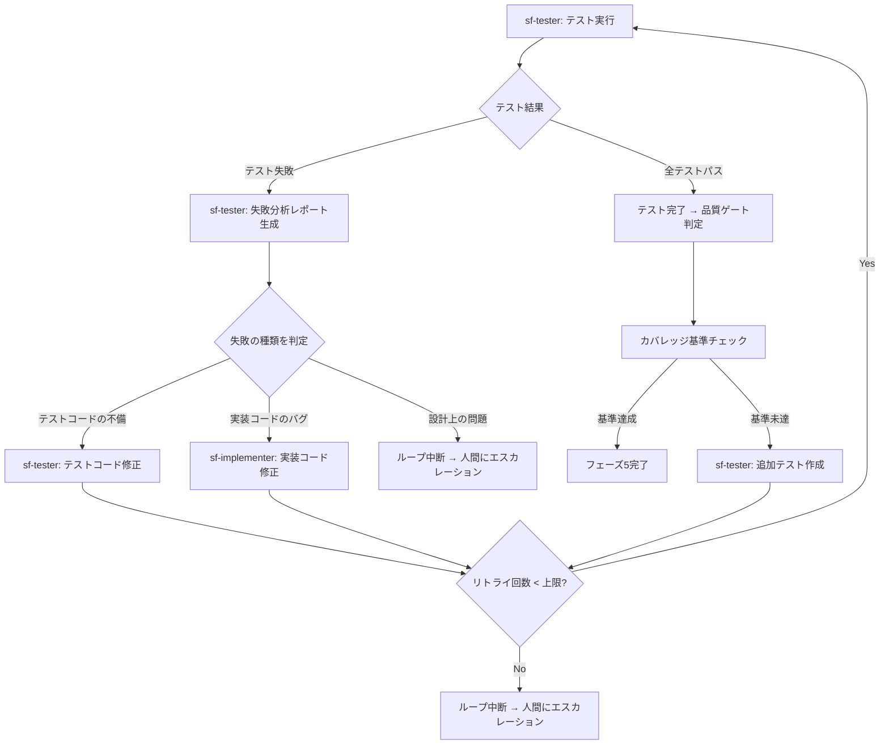
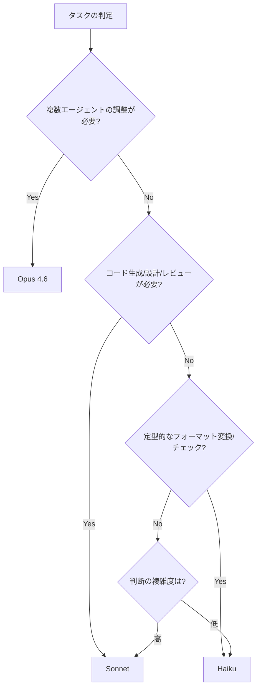
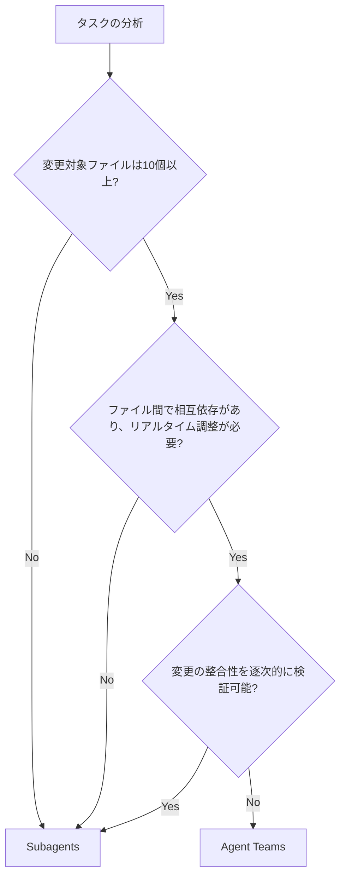
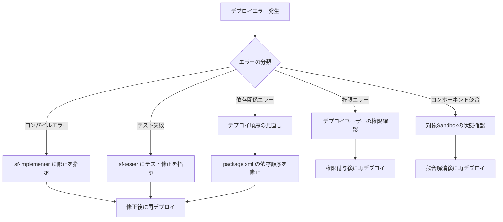

# 05. 品質保証 & 運用ガイド（Copilot CLI版）

本ドキュメントは、Copilot CLIマルチエージェント構成によるSalesforce開発フレームワークの品質基準、コスト管理、アンチパターン、トラブルシューティング、および運用定着に関するガイドラインを定義する。

---

## 目次

1. [品質ゲート設計](#1-品質ゲート設計)
2. [コスト管理](#2-コスト管理)
3. [アンチパターン集](#3-アンチパターン集)
4. [トラブルシューティング](#4-トラブルシューティング)
5. [運用定着のためのガイド](#5-運用定着のためのガイド)

---

## 1. 品質ゲート設計

### 1.1 各フェーズの完了判定基準

各フェーズには定量的な完了判定基準（Exit Criteria）を設ける。すべての基準を満たした場合にのみ次フェーズへ進行可能とする。

#### Phase 0: 初期セットアップ & メタデータ取得

| # | 判定基準 | 閾値 |
|---|---------|------|
| 1 | Must Haveメタデータの取得成功率 | 100%（全種別を取得完了） |
| 2 | メタデータサマリの生成完了 | ER図相当の構造化ドキュメントが出力されていること |
| 3 | オブジェクト間リレーションの網羅率 | Lookup/Master-Detail関係の95%以上を正しく記述 |
| 4 | `sfdx-project.json` との整合性 | パッケージディレクトリが正しくマッピングされていること |

#### Phase 1: 要件定義

| # | 判定基準 | 閾値 |
|---|---------|------|
| 1 | ユーザー要件のカバー率 | 入力要件の100%が要件定義書に記載されていること |
| 2 | 既存メタデータとの照合完了 | 影響を受ける既存オブジェクト・項目・自動化がすべて特定されていること |
| 3 | 要件の曖昧性スコア | 各要件に受入基準（Acceptance Criteria）が定義されていること |
| 4 | 影響範囲の特定 | 変更対象オブジェクト、フロー、Apexクラスの一覧が確定していること |

#### Phase 2: 設計

| # | 判定基準 | 閾値 |
|---|---------|------|
| 1 | 要件トレーサビリティ | 要件定義書の全項目が設計書内で参照されていること |
| 2 | ガバナ制限の事前評価 | SOQL/DML/CPU時間の消費見積もりが記載されていること |
| 3 | セキュリティ設計 | FLS/CRUD権限チェックの方針が明記されていること |
| 4 | テスト設計 | テスト戦略（正常系/異常系/バルクテストのシナリオ概要）が含まれていること |
| 5 | データモデル変更の影響分析 | 新規/変更項目に対するバリデーションルール・フローへの影響が評価されていること |
| 6 | ADRとの整合性 | `docs/architecture/decisions/` の既存ADRと矛盾しないこと。矛盾する場合はADR更新が提案されていること |
| 7 | 横断的方針への準拠 | `docs/architecture/policies/` のセキュリティ・パフォーマンス・連携・エラーハンドリング方針に準拠していること |
| 8 | レイヤー構成の遵守 | `docs/architecture/system-context.md` のレイヤー構成に沿った設計であること |

#### Phase 3: 実装

| # | 判定基準 | 閾値 |
|---|---------|------|
| 1 | 設計書との整合性 | 設計書に記載された全クラス・コンポーネントが実装されていること |
| 2 | コンパイル成功率 | 100%（全Apexクラスがコンパイルエラーなし） |
| 3 | 命名規約準拠率 | 100%（クラス名、メソッド名、変数名が規約に準拠） |
| 4 | FLS/CRUDチェックの実装 | セキュリティ関連コードが設計書通りに実装されていること |
| 5 | バルク化対応 | トリガ/バッチ処理がList操作でバルク対応していること |

#### Phase 4: テスト

| # | 判定基準 | 閾値 |
|---|---------|------|
| 1 | Apexコードカバレッジ | 全体75%以上（Salesforceデプロイ要件）、対象クラス個別80%以上（目標） |
| 2 | テスト成功率 | 100%（全テストメソッドがパス） |
| 3 | バルクテスト実施 | 200件以上のレコードによるバルクテストが少なくとも1つ実施されていること |
| 4 | 異常系テスト網羅率 | 主要な異常系パターン（権限不足、必須項目不足、重複レコード）がカバーされていること |
| 5 | テスト独立性 | `@TestSetup` または各テストメソッド内でテストデータが自己完結していること |
| 6 | 静的解析スクリプトの実行 | `static-analysis-governor.txt` と `static-analysis-fls.txt` が `docs/projects/{PID}/test-results/` に生成されていること |

#### Phase 5-6: コードレビュー & PR作成

| # | 判定基準 | 閾値 |
|---|---------|------|
| 1 | P1（Critical）指摘 | 0件であること |
| 2 | P2（Major）指摘 | すべて対応済みであること |
| 3 | P3（Minor）指摘 | 対応済みまたは対応方針が明記されていること |
| 4 | PR本文の完備性 | 変更概要、テスト結果、影響範囲がすべて記載されていること |
| 5 | デプロイ検証 | Scratch Orgまたは開発Sandboxへのデプロイが成功していること |

---

### 1.2 ヒューマンゲートの挿入/除外の判断基準と設定方法

#### 判断基準マトリクス

| 条件 | 推奨設定 | 理由 |
|------|---------|------|
| 本番環境に影響する変更 | ゲート有効 | 本番障害リスクの最小化 |
| 既存データモデルの変更を伴う | ゲート有効 | データ移行・既存機能への影響を人間が判断 |
| 新規オブジェクト/機能の追加のみ | ゲート除外可 | 既存機能への影響が限定的 |
| 検証環境（Scratch Org）のみの操作 | ゲート除外可 | リスクが限定的 |
| チームが本フレームワークに習熟済み | 段階的に除外 | 信頼度に応じて自律度を向上 |
| 初回導入・チーム未習熟 | 全ゲート有効 | 出力品質の確認と学習のため |

#### 設定方法

案件設定ファイル（`docs/projects/{PROJECT_ID}/project-config.json`）の `humanGates` セクションで各フェーズのゲートを制御する:

```json
// docs/projects/{PROJECT_ID}/project-config.json 内
"humanGates": {
  "gate_requirements": true,
  "gate_design": true,
  "gate_test": true,
  "gate_pr": true
}
```

リードエージェントは各フェーズ完了時に以下のコマンドでゲート設定を確認する:

```bash
jq -r '.humanGates.gate_requirements' docs/projects/${PROJECT_ID}/project-config.json
```

- `true`: そのフェーズ完了後に人間の承認を必要とする（リードエージェントが承認要求メッセージでターンを終了し、人間の応答を待つ）
- `false`: 自動的に次フェーズへ進行する

**推奨初期設定**: すべて `true` で開始し、運用に慣れた段階で信頼性が確認されたフェーズから順次 `false` に変更する。

---

### 1.3 自律フィードバックループの構成

テストフェーズにおいて、テスト失敗時に自動で修正・再テストを行うフィードバックループを構成する。

#### フィードバックループのフロー



#### ループ制御パラメータ

| パラメータ | デフォルト値 | 説明 |
|-----------|------------|------|
| `maxRetryCount` | 3 | テスト→修正→再テストの最大リトライ回数 |
| `maxRetryPerTestMethod` | 2 | 同一テストメソッドに対する修正リトライ上限 |
| `escalationThreshold` | 同一エラーが2回連続発生 | 同一原因のエラーが繰り返される場合にエスカレーション |
| `coverageTarget` | 80% | カバレッジ目標（個別クラス） |
| `coverageMinimum` | 75% | カバレッジ最低ライン（全体） |

#### エスカレーション条件

以下のいずれかに該当する場合、自動ループを中断し人間にエスカレーションする:

1. リトライ回数が `maxRetryCount` に到達
2. 同一エラーが `escalationThreshold` 回連続で発生
3. 失敗原因が「設計上の問題」と判定された場合
4. コンパイルエラーが修正ループ内で解消しない場合

---

### 1.4 コードレビューの品質基準（Severity分類）

`sf-code-reviewer` が出力するレビュー結果には、以下のSeverity分類を適用する。

#### Severity定義

| Severity | レベル | 定義 | 対応要否 | 例 |
|----------|-------|------|---------|-----|
| **P1** | Critical | 本番障害・データ破損・セキュリティ脆弱性を引き起こす問題 | **必須（即時対応）** | SOQLインジェクション、FLS未チェックでのDML、`without sharing` の不適切な使用、トリガ内の無限ループ |
| **P2** | Major | ガバナ制限違反リスク、パフォーマンス劣化、ビジネスロジックの誤りを引き起こす問題 | **必須（リリース前に対応）** | ループ内SOQL/DML、バルク化未対応、ハードコードされたID、`System.debug` のみのエラーハンドリング |
| **P3** | Minor | ベストプラクティスからの逸脱、保守性の低下を引き起こす問題 | **推奨（対応方針を明記）** | 命名規約違反、過度に長いメソッド（50行超）、コメント不足、テストメソッドの `@isTest` アノテーション欠落 |
| **P4** | Info | コード品質の改善提案、将来的なリファクタリング候補 | **任意（バックログに記録）** | より効率的なコレクション操作の提案、共通化可能なコードの指摘、ドキュメント改善提案 |

#### レビュー結果の出力形式

```json
{
  "reviewId": "CR-2026-0001",
  "timestamp": "2026-03-09T10:00:00Z",
  "reviewer": "sf-code-reviewer",
  "summary": {
    "totalFindings": 5,
    "p1": 0,
    "p2": 1,
    "p3": 3,
    "p4": 1
  },
  "passGate": true,
  "findings": [
    {
      "id": "F001",
      "severity": "P2",
      "category": "governor-limits",
      "file": "force-app/main/default/classes/AccountService.cls",
      "line": 42,
      "message": "ループ内でSOQLクエリが実行されています。ループ外でMap/Setに事前ロードしてください。",
      "suggestion": "ループ前に必要なデータをMapに格納し、ループ内ではMap.get()で参照する",
      "reference": "https://developer.salesforce.com/docs/atlas.en-us.apexcode.meta/apexcode/apex_gov_limits.htm"
    }
  ]
}
```

#### ゲート通過条件

- P1指摘が **0件**
- P2指摘が **すべて対応済み**
- P3指摘について **対応方針（対応する/次回対応/対応しない+理由）が明記されている**

---

## 2. コスト管理

### 2.1 フェーズ別トークン消費量の見積もり目安

以下は中規模案件（カスタムオブジェクト3-5個、Apexクラス5-10個程度の新規開発）を想定した見積もりである。

| フェーズ | 主担当モデル | 入力トークン目安 | 出力トークン目安 | 合計目安 | 備考 |
|---------|------------|----------------|----------------|---------|------|
| 1. メタデータ取得 | Sonnet | 30,000-50,000 | 10,000-20,000 | 40,000-70,000 | メタデータ量に比例 |
| 2. 要件定義 | Sonnet | 20,000-40,000 | 8,000-15,000 | 28,000-55,000 | ユーザー要件の複雑度に依存 |
| 3. 設計 | Sonnet | 40,000-80,000 | 15,000-30,000 | 55,000-110,000 | メタデータサマリを入力に含むため大きい |
| 4. 実装 | Sonnet | 50,000-100,000 | 20,000-50,000 | 70,000-150,000 | コード生成量に比例 |
| 5. テスト | Sonnet | 40,000-80,000 | 15,000-40,000 | 55,000-120,000 | リトライ回数で増加 |
| 6. レビュー & PR | Sonnet | 30,000-60,000 | 5,000-15,000 | 35,000-75,000 | レビュー対象コード量に比例 |
| オーケストレーション | Opus | 10,000-20,000 | 3,000-8,000 | 13,000-28,000 | 各フェーズの呼び出し制御 |
| **合計（1回の開発サイクル）** | - | **220,000-430,000** | **76,000-178,000** | **296,000-608,000** | - |

**注意事項**:
- テストフェーズのフィードバックループが3回発生した場合、テストフェーズのトークン消費は約2-3倍になる
- メタデータ量が多い組織（カスタムオブジェクト50個以上）では、フェーズ1の消費量が大幅に増加する
- `/compact` の適切な実行により、フェーズをまたぐ累積コンテキストを30-50%削減可能

---

### 2.2 コスト最適化のためのモデル選択指針

| モデル | 推奨用途 | 不向きな用途 | コスト比率目安 |
|-------|---------|------------|--------------|
| **Opus 4.6** | リードエージェントとしてのオーケストレーション、複雑な判断を伴うエスカレーション対応、最終的な品質判定 | 定型的なコード生成、単純なメタデータ取得 | 高（基準: 1.0x） |
| **Sonnet** | サブエージェントの主モデル。コード生成、設計書作成、テスト作成、コードレビュー | 極めて単純なタスク、大量の定型処理 | 中（約0.2x） |
| **Haiku** | メタデータのフォーマット変換、テンプレート穴埋め、簡易的なバリデーションチェック、ステータス確認 | 複雑なビジネスロジックの設計、セキュリティレビュー | 低（約0.04x） |

#### モデル選択のディシジョンツリー



#### コスト削減のための実践ポイント

1. **リードエージェントのトークン節約**: Opusはオーケストレーション指示と最終判断のみに使用し、実作業はSonnetサブエージェントに委任する
2. **Haikuの積極活用**: メタデータのJSON→Markdown変換、設定ファイルの構文チェック等の軽量タスクはHaikuで処理する
3. **不要なコンテキストの排除**: サブエージェントへの指示には必要最小限の情報のみを渡す。全メタデータを渡すのではなく、関連部分のみを抽出して渡す

---

### 2.3 `/compact` と `/clear` の戦略的実行タイミング

#### `/compact` の実行タイミング

`/compact` はコンテキストウィンドウの使用量を圧縮するコマンドであり、会話の要約を生成して以降のトークン消費を抑制する。

| タイミング | 推奨度 | 理由 |
|-----------|-------|------|
| フェーズ完了直後（次フェーズ開始前） | 必須 | 前フェーズの詳細な中間出力をコンテキストから圧縮し、次フェーズに必要な要約のみ保持 |
| メタデータサマリ生成完了後 | 必須 | 生のメタデータをコンテキストから除去し、構造化サマリのみ保持 |
| テストのフィードバックループ2回目以降 | 推奨 | 過去のテスト失敗ログを圧縮し、最新の失敗情報に集中 |
| コンテキスト使用率70%超過時 | 推奨 | 上限到達前に予防的に圧縮 |
| サブエージェント呼び出し3回以上連続した後 | 推奨 | サブエージェントの出力がコンテキストを圧迫するため |

#### `/clear` の実行タイミング

`/clear` はコンテキストを完全にリセットするコマンドであり、`AGENTS.md` と直近のファイル状態のみが保持される。

| タイミング | 推奨度 | 理由 |
|-----------|-------|------|
| 案件の全フェーズ完了後、次案件の開始前 | 必須 | 前案件のコンテキストが残留するとノイズになる |
| フェーズ間でコンテキスト使用率が90%を超えた場合 | 必須 | `/compact` では不十分な場合の最終手段 |
| デバッグが長引き、コンテキストが混乱した場合 | 推奨 | 不要な試行錯誤の履歴をリセット |

**注意**: `/clear` 実行前に、必要な中間成果物がすべてファイルに書き出されていることを確認すること。コンテキスト内のみに存在する情報は消失する。

---

### 2.4 Agent Teams vs Subagents の使い分け判断基準

本フレームワークは原則として **Subagents パターン** を採用する。Agent Teams の利用は限定的な場面に留める。

| 判断基準 | Subagents（推奨） | Agent Teams |
|---------|-------------------|-------------|
| タスクの依存関係 | 逐次的（前フェーズの出力が次の入力） | 独立並行（互いに参照不要） |
| オーケストレーション | リードエージェントが制御 | 各エージェントが自律的に動作 |
| コンテキスト共有 | リードが必要な情報を選別して渡す | 全エージェントが同一コンテキストを共有 |
| コスト効率 | 高い（必要最小限のコンテキスト） | 低い（コンテキスト共有のオーバーヘッド） |
| 適用場面 | 通常の開発フロー全般 | 大規模リファクタリング、複数モジュールの同時改修 |

#### Agent Teams が適切な場面（例外的）

1. **大規模リファクタリング**: 10ファイル以上を同時に横断的に修正する必要があり、変更間の整合性をリアルタイムで保つ必要がある場合
2. **複数LWCの同時開発**: 親子関係にある複数のLWCコンポーネントを同時に開発し、相互のインターフェースを調整する場合
3. **データモデル変更と関連コードの同時修正**: オブジェクト構造の変更と、それに依存する複数のApexクラス・フロー・LWCを一括で修正する場合

#### 判断フローチャート



---

## 3. アンチパターン集

### 3.1 Salesforce開発特有のアンチパターン

#### AP-SF-01: ループ内SOQL/DML（ガバナ制限違反）

| 項目 | 内容 |
|------|------|
| **概要** | `for` ループ内で `Database.query()` や `insert/update/delete` を実行し、ガバナ制限（SOQL: 100回、DML: 150回）に抵触する |
| **危険度** | P1（Critical） |
| **検知方法** | `sf-code-reviewer` がApexコードを静的解析し、ループ構造内のSOQL/DML文を検出。正規表現パターン: `for\s*\(.*\)\s*\{[^}]*(SELECT|INSERT|UPDATE|DELETE|Database\.)` |
| **回避策** | ループ前にMapまたはSetにデータを事前ロードし、ループ内ではコレクション操作のみ行う。DMLはリストに蓄積してループ外で一括実行する |
| **サブエージェントでの対策** | `sf-implementer` のシステムプロンプトに「ループ内でのSOQL/DMLは絶対に行わない」ルールを明記。`sf-tester` でバルクテスト（200件）を必須化 |

#### AP-SF-02: FLS/CRUDチェック未実装

| 項目 | 内容 |
|------|------|
| **概要** | `Schema.sObjectType.Account.fields.Name.isAccessible()` 等のFLSチェック、または `Schema.sObjectType.Account.isCreateable()` 等のCRUDチェックを行わずにデータ操作を実行する |
| **危険度** | P1（Critical） |
| **検知方法** | `sf-code-reviewer` が `WITH SECURITY_ENFORCED` または `Security.stripInaccessible()` の使用有無を確認。Apexクラス内で直接SOQLを実行している箇所にチェックが欠如している場合に指摘 |
| **回避策** | SOQLクエリには `WITH SECURITY_ENFORCED` を付与する。DML操作前に `Security.stripInaccessible()` を適用する。または `WITH USER_MODE` を使用する |
| **サブエージェントでの対策** | `sf-implementer` が生成するすべてのSOQLに `WITH SECURITY_ENFORCED` をデフォルト付与するルールを設定 |

#### AP-SF-03: バルク化未対応

| 項目 | 内容 |
|------|------|
| **概要** | トリガやバッチ処理が単一レコードの処理を前提としており、`Trigger.new` に200件のレコードが含まれた場合に正しく動作しない |
| **危険度** | P2（Major） |
| **検知方法** | `sf-code-reviewer` がトリガ内で `Trigger.new[0]` のようなインデックス直接アクセスを検出。または `Trigger.new.size() == 1` を前提とするロジックを検出 |
| **回避策** | すべてのトリガロジックは `Trigger.new` のリストをイテレーションする形式で実装する。ヘルパークラスのメソッドは `List<SObject>` を引数に取る |
| **サブエージェントでの対策** | `sf-tester` が200件のレコードを使用したバルクテストを必ず作成するルールを設定 |

#### AP-SF-04: ハードコードされたレコードID

| 項目 | 内容 |
|------|------|
| **概要** | Apexコード内にレコードIDやOrganization IDを直接記述しており、環境間移行時に動作しない |
| **危険度** | P2（Major） |
| **検知方法** | `sf-code-reviewer` が15桁または18桁のSalesforce IDパターン（`[a-zA-Z0-9]{15,18}`）のハードコードを検出 |
| **回避策** | Custom MetadataまたはCustom Settingに外部化する。テストコード内ではテストデータを動的に生成する |
| **サブエージェントでの対策** | `sf-implementer` のプロンプトにハードコードID禁止ルールを明記 |

#### AP-SF-05: テストデータの `@SeeAllData=true` 使用

| 項目 | 内容 |
|------|------|
| **概要** | テストクラスで `@isTest(SeeAllData=true)` を使用し、組織のデータに依存したテストを作成している |
| **危険度** | P2（Major） |
| **検知方法** | `sf-code-reviewer` が `SeeAllData=true` アノテーションの存在を検出 |
| **回避策** | `@TestSetup` メソッドでテストデータを自己生成する。テストユーティリティクラス（`TestDataFactory`）を活用する |
| **サブエージェントでの対策** | `sf-tester` のプロンプトに `SeeAllData=true` 禁止ルールを明記。例外が必要な場合（一部の標準オブジェクトのクエリ等）は理由を明記させる |

#### AP-SF-06: `without sharing` の不適切な使用

| 項目 | 内容 |
|------|------|
| **概要** | セキュリティ上の正当な理由なく `without sharing` キーワードを使用し、共有ルールをバイパスしている |
| **危険度** | P1（Critical） |
| **検知方法** | `sf-code-reviewer` が `without sharing` の使用箇所を検出し、使用理由のコメントまたはドキュメント記載を確認 |
| **回避策** | デフォルトは `with sharing` を使用する。`without sharing` が必要な場合は、そのクラスに理由をコメントで明記し、影響範囲を最小化する（`without sharing` のクラスを小さく保つ） |
| **サブエージェントでの対策** | `sf-implementer` はデフォルトで `with sharing` を使用。`without sharing` が必要な場合は設計書に理由が明記されていることを確認 |

---

### 3.2 マルチエージェント運用のアンチパターン

#### AP-MA-01: 過剰オーケストレーション

| 項目 | 内容 |
|------|------|
| **概要** | リードエージェント（Opus）がすべてのサブエージェント呼び出しを細かく制御しすぎ、1つの操作ごとにOpusに戻って判断させる構成 |
| **問題** | Opusの高コストなトークンが大量に消費され、全体のコストが不必要に膨らむ |
| **検知方法** | 1フェーズ内でOpusのトークン消費がSonnetを上回っている場合に疑う |
| **回避策** | サブエージェントには十分な自律性を持たせ、フェーズ単位でタスクを委任する。リードエージェントの介入はフェーズ間の判断と品質ゲートチェックに限定する |

#### AP-MA-02: サブエージェント過多

| 項目 | 内容 |
|------|------|
| **概要** | 機能ごとに細かくサブエージェントを分割しすぎ、7個以上のサブエージェントを定義している |
| **問題** | リードエージェントの選択判断が複雑化し、誤ったサブエージェントが選択されるリスクが増加。定義の保守コストも増大する |
| **検知方法** | `.github/agents/` 配下のエージェント定義が7ファイル以上ある場合 |
| **回避策** | サブエージェントは6個以下に抑える（本フレームワークの推奨構成）。類似の役割は1つのサブエージェントに統合する |

#### AP-MA-03: コンテキストの過剰転送

| 項目 | 内容 |
|------|------|
| **概要** | サブエージェントに全メタデータや全ソースコードを丸ごと渡してしまい、コンテキストウィンドウを無駄に消費する |
| **問題** | トークンコストの増大に加え、無関係な情報によりサブエージェントの出力品質が低下する |
| **検知方法** | サブエージェントへの入力トークンが50,000を超えている場合に疑う |
| **回避策** | 各サブエージェントには当該タスクに必要な情報のみを選別して渡す。メタデータは関連オブジェクトのみ抽出する。ソースコードは変更対象ファイルとその直接依存ファイルのみ渡す |

#### AP-MA-04: フィードバックループの無限化

| 項目 | 内容 |
|------|------|
| **概要** | テスト→修正→再テストのフィードバックループにリトライ上限が設定されておらず、解決不能な問題に対してループが無限に続く |
| **問題** | トークンの大量消費と時間の浪費。コンテキスト溢れの原因にもなる |
| **検知方法** | テストフェーズの実行時間が他フェーズの3倍以上、またはリトライ回数が3回を超えた場合 |
| **回避策** | `maxRetryCount`（デフォルト: 3）を設定し、上限到達時は人間にエスカレーションする。同一エラーの連続発生も検知してエスカレーションする |

#### AP-MA-05: 中間成果物の未永続化

| 項目 | 内容 |
|------|------|
| **概要** | 要件定義書や設計書をコンテキスト内のみで保持し、Markdownファイルとして書き出していない |
| **問題** | `/compact` や `/clear` 実行時に成果物が消失する。人間によるレビューも困難になる |
| **検知方法** | フェーズ完了時に対応する中間成果物ファイルが出力ディレクトリに存在しない場合 |
| **回避策** | 各フェーズの完了条件に「中間成果物がファイルとして出力されていること」を含める。リードエージェントがファイルの存在を確認してから次フェーズに進む |

---

## 4. トラブルシューティング

### 4.1 メタデータ取得失敗時の対応手順

#### 症状と原因の診断

| 症状 | 想定原因 | 確認コマンド |
|------|---------|------------|
| `ERROR running project retrieve start: No org found` | 組織認証が未実施または期限切れ | `sf org list --all` |
| `ERROR: INVALID_TYPE: sObject type 'XXX' is not supported` | 指定したメタデータ型が存在しない、またはAPI名が誤り | `sf org list metadata-types -o <alias>` |
| `ERROR: INSUFFICIENT_ACCESS` | 実行ユーザーの権限不足 | 対象組織のプロファイル/権限セットを確認 |
| タイムアウトエラー | メタデータ量が大きすぎる、ネットワーク遅延 | `sf project retrieve start` に `--wait 30` を付与して再実行 |
| 一部のメタデータのみ取得失敗 | `package.xml` の記述誤り | `package.xml` のメタデータ型名・メンバー名を確認 |

#### リカバリ手順

```
Step 1: 認証状態の確認
  $ sf org list --all
  → 対象組織が一覧に表示されること、Statusが「Connected」であることを確認

Step 2: 認証の再実行（期限切れの場合）
  $ sf org login web -a <alias> -r <instance-url>

Step 3: メタデータ型の確認
  $ sf org list metadata-types -o <alias> --output-file metadata-types.json
  → 取得対象のメタデータ型がサポートされていることを確認

Step 4: 段階的取得による問題の切り分け
  → Must Haveメタデータを1種別ずつ取得し、失敗する種別を特定
  $ sf project retrieve start -m "CustomObject" -o <alias>
  $ sf project retrieve start -m "ApexClass" -o <alias>
  ... （種別ごとに実行）

Step 5: 問題が解決しない場合
  → sf-metadata-analyst サブエージェントにエラーメッセージを渡し、
     代替取得方法（Metadata API直接呼び出し、Tooling API等）を検討させる
```

---

### 4.2 デプロイエラー時のリカバリフロー

#### デプロイエラーの分類と対処



#### 具体的なリカバリ手順

**コンパイルエラーの場合:**

```
Step 1: エラーメッセージを確認
  $ sf project deploy start -d force-app -o <alias> 2>&1 | tee deploy-result.log

Step 2: sf-implementer にエラーログを渡して修正を指示
  → エラーメッセージ、対象ファイル、行番号を含めて指示

Step 3: 修正後のローカルコンパイルチェック
  $ sf apex run -f <test-file> -o <alias>

Step 4: 再デプロイ
  $ sf project deploy start -d force-app -o <alias> --dry-run
  → dry-runで問題なければ本デプロイを実行
```

**依存関係エラーの場合:**

```
Step 1: 依存関係の特定
  → エラーメッセージから依存先コンポーネントを特定

Step 2: デプロイ順序の調整
  → カスタムオブジェクト → カスタム項目 → Apexクラス → トリガ → フロー
     の順にデプロイするよう package.xml を分割

Step 3: 段階デプロイ
  $ sf project deploy start -m "CustomObject:MyObject__c" -o <alias>
  $ sf project deploy start -m "ApexClass:MyService" -o <alias>
```

---

### 4.3 コンテキスト溢れの症状と対処法

#### 症状の識別

| 症状 | 深刻度 | 説明 |
|------|-------|------|
| レスポンスの途中切れ | 高 | 出力が不完全な状態で終了する |
| 以前の指示内容の忘却 | 高 | フェーズ初期の要件や設計方針を無視した出力が返される |
| サブエージェントの出力品質低下 | 中 | 指示に含まれない内容を生成する、既存コードと矛盾する出力を返す |
| レスポンス速度の著しい低下 | 低 | 応答時間が通常の2倍以上に延びる |

#### 対処法

**予防的対処（発生前）:**

1. 各フェーズ完了後に `/compact` を実行する
2. サブエージェントへの入力は必要最小限に選別する
3. メタデータサマリは抽象化レベルを上げ、項目レベルの詳細は必要時のみ展開する
4. テストのフィードバックループ内で過去の試行ログを毎回含めない（最新の失敗情報のみ渡す）

**発生時の対処:**

```
Step 1: 現在の中間成果物をすべてファイルに保存
  → 要件定義書、設計書、実装済みコード、テスト結果がすべて
     ファイルとして永続化されていることを確認

Step 2: /compact を実行
  → コンテキストの圧縮を試みる

Step 3: /compact で改善しない場合は /clear を実行
  → AGENTS.md に記載されたプロジェクト情報は保持される
  → 中間成果物ファイルからコンテキストを再構築

Step 4: 必要な中間成果物を再読み込み
  → 現在のフェーズに必要なファイルのみを明示的に読み込ませる
  （例: 実装フェーズなら設計書とメタデータサマリのみ）
```

---

### 4.4 サブエージェントの期待外動作時のデバッグ手順

#### 期待外動作の類型と原因

| 類型 | 典型的な症状 | 主な原因 |
|------|------------|---------|
| 指示無視 | 指定したファイル構成や命名規約に従わない | プロンプトの指示が不明確、またはコンテキスト内に矛盾する情報がある |
| 過剰実行 | 指示していないファイルの変更や新規作成を行う | タスクスコープが曖昧、ツール権限が過剰 |
| 品質低下 | ガバナ制限を無視したコード、FLSチェック欠落 | instructions/ が自動適用されていない（applyTo の設定ミス）、Skills が発火していない、入力コンテキストが過大で指示が埋没 |
| 幻覚 | 存在しないAPIやメソッドを使用したコード生成 | メタデータサマリに含まれないオブジェクト/項目を参照 |
| 停滞 | 応答が返らない、または無意味な応答を繰り返す | コンテキスト溢れ、タスクの複雑度がモデル能力を超過 |

#### デバッグ手順

```
Step 1: サブエージェントの出力を確認
  → 出力ファイルの内容を確認し、期待と実際の差分を特定

Step 2: サブエージェントへの入力を確認
  → リードエージェントがサブエージェントに渡した指示内容を確認
  → 必要な情報が含まれているか、矛盾する情報がないか確認

Step 3: エージェント定義とルール適用の確認
  → .github/agents/ 配下の対象エージェント定義ファイルを確認
  → description が適切か、ツール権限は適切か
  → .github/instructions/ のルールが自動適用されているか確認（globs 設定の妥当性）
  → .github/skills/ の参照ポインタが含まれているか確認

Step 4: 問題の切り分け
  a) 入力の問題 → リードエージェントの指示を改善
  b) プロンプトの問題 → エージェント定義のシステムプロンプトを修正
  c) ツール権限の問題 → 必要なツールの追加または不要なツールの削除
  d) モデル能力の問題 → タスクの分割、またはモデルの変更を検討

Step 5: 修正後の再実行
  → 修正した内容でサブエージェントを再実行し、出力を確認
  → 問題が解消しない場合はStep 2に戻る

Step 6: エスカレーション
  → 3回の修正・再実行で解消しない場合は、人間が介入して
     タスクの分割方法やエージェント構成の見直しを検討する
```

#### よくある原因と対策の早見表

| 問題 | 原因 | 対策 |
|------|------|------|
| `sf-implementer` が `without sharing` を多用する | `instructions/apex-coding.instructions.md` が適用されていない | globs 設定（`*.cls`）が正しいか確認。instructions/ ファイルの存在を確認 |
| `sf-tester` が `@SeeAllData=true` を使用する | `instructions/test-coding.instructions.md` が適用されていない | globs 設定（`*Test.cls`）が正しいか確認 |
| `sf-designer` が非現実的な設計を出力する | メタデータサマリが不十分で既存構造を把握できていない | メタデータサマリの情報量を増やす |
| `sf-code-reviewer` が軽微な問題のみ指摘する | `instructions/review-rules.instructions.md` が適用されていない、静的解析結果ファイルが存在しない | review-rules.md の description を確認。`docs/projects/{PID}/test-results/static-analysis-*.txt` の存在を確認（sf-tester が Phase 4 で生成するもの） |
| `sf-metadata-analyst` がメタデータを取得しすぎる | 取得範囲の指示が曖昧 | Must Have/Nice to Haveの分類を指示に含める |
| ガバナ制限を無視したコードが生成される | instructions/ の自動適用が機能していない | `instructions/apex-coding.instructions.md` の globs 設定を確認。skills/ の description にトリガーキーワードを追加 |

---

## 5. 運用定着のためのガイド

### 5.1 導入ステップ（段階的な機能追加の推奨順序）

一度にすべての機能を導入するのではなく、以下のステップに沿って段階的に導入することを推奨する。

#### ステップ1: 基盤構築（1-2日）

| 作業内容 | 詳細 |
|---------|------|
| Copilot CLIのインストールと設定 | `copilot.json` の基本設定、`sf` コマンドの権限許可 |
| `AGENTS.md` の作成 | プロジェクトルート用テンプレートをベースに作成 |
| 対象組織への接続確認 | `sf org login web` で認証し、基本的なメタデータ取得を確認 |
| **到達基準** | CLIからSalesforce組織のメタデータを取得できる状態 |

#### ステップ2: 単一エージェントでの検証（2-3日）

| 作業内容 | 詳細 |
|---------|------|
| `sf-metadata-analyst` の定義と実行 | メタデータ取得・構造化の動作確認 |
| メタデータサマリの品質確認 | ER図相当の出力が実用的であることを人間が確認 |
| `AGENTS.md` の調整 | 実行結果を踏まえてルールや規約を調整 |
| **到達基準** | メタデータの取得と構造化が安定して動作する |

#### ステップ3: 要件定義〜設計の自動化（3-5日）

| 作業内容 | 詳細 |
|---------|------|
| `sf-requirements-analyst` の定義と実行 | 要件定義書の自動生成を確認 |
| `sf-designer` の定義と実行 | 設計書の自動生成を確認 |
| ヒューマンゲートの動作確認 | 要件定義後・設計後の承認フローが機能することを確認 |
| 中間成果物のレビュー | 生成された要件定義書・設計書の品質を人間が評価 |
| **到達基準** | 要件入力から設計書までの自動生成が実用的な品質で動作する |

#### ステップ4: 実装〜テストの自動化（5-7日）

| 作業内容 | 詳細 |
|---------|------|
| `sf-implementer` の定義と実行 | コード生成の動作確認 |
| `sf-tester` の定義と実行 | テスト作成・実行の動作確認 |
| フィードバックループの確認 | テスト→修正→再テストの自律サイクルが機能することを確認 |
| 品質ゲートの調整 | カバレッジ目標や品質基準を実態に合わせて調整 |
| **到達基準** | 設計書からコードとテストが自動生成され、フィードバックループが機能する |

#### ステップ5: レビュー〜PR作成の自動化（2-3日）

| 作業内容 | 詳細 |
|---------|------|
| `sf-code-reviewer` の定義と実行 | コードレビューの動作確認 |
| PR自動生成の確認 | PR本文の自動生成テンプレートが機能することを確認 |
| Severity分類の調整 | レビュー指摘のSeverity基準を実態に合わせて調整 |
| **到達基準** | 全フェーズを通しで実行し、PRが自動生成される |

#### ステップ6: 運用最適化（継続的）

| 作業内容 | 詳細 |
|---------|------|
| ヒューマンゲートの段階的解除 | 信頼性が確認されたフェーズからゲートを解除 |
| コスト最適化 | トークン消費の実測に基づきモデル選択やコンテキスト管理を調整 |
| エージェント定義のチューニング | 実運用のフィードバックに基づきプロンプトを改善 |
| Hooksの追加 | フォーマッター自動実行、通知等のHooksを段階的に追加 |
| **到達基準** | 定常的にフレームワークを活用した開発が回っている状態 |

---

### 5.2 複数人運用時の役割分担

#### ロール定義

| ロール | 担当者数目安 | 責務 |
|--------|------------|------|
| **運用者（Operator）** | 1-3名 | 日常的にフレームワークを使用して開発タスクを実行する。案件の要件入力、フレームワークの実行、ヒューマンゲートでの承認を担当 |
| **レビュワー（Reviewer）** | 1-2名 | エージェントが生成した成果物（設計書、コード、テスト）の最終品質チェックを担当。PRのレビューと承認を行う |
| **管理者（Administrator）** | 1名 | フレームワーク自体の保守を担当。エージェント定義の更新、AGENTS.mdの管理、メタデータカタログの更新、品質基準の見直しを行う |

#### 各ロールの具体的な作業内容

**運用者（Operator）の作業フロー:**

```
1. 案件の要件を整理し、テンプレートに記入
2. フレームワークを起動（CLIコマンド実行）
3. ヒューマンゲートでの確認・承認
   - 要件定義書の確認（業務要件の正確性）
   - 設計書の確認（技術方針の妥当性）
   - テスト結果の確認（カバレッジ・テスト内容の妥当性）
4. エラー発生時の一次対応（トラブルシューティングガイド参照）
5. PR作成後、レビュワーに引き継ぎ
```

**レビュワー（Reviewer）の作業フロー:**

```
1. エージェントが生成したPRの内容を確認
   - コード品質（ガバナ制限、FLS、バルク化対応）
   - 設計書との整合性
   - テスト網羅率と品質
2. エージェントのレビュー結果（sf-code-reviewer出力）を参照しつつ、
   人間の観点で追加チェック
   - ビジネスロジックの正確性
   - エッジケースの考慮
   - 既存機能への影響
3. 承認またはフィードバック（修正依頼）
```

**管理者（Administrator）の作業フロー:**

```
1. エージェント定義の管理
   - 実運用のフィードバックに基づくプロンプトの改善
   - 新しいサブエージェントの追加検討
   - 不要になったサブエージェントの廃止
2. AGENTS.md の管理
   - 開発規約の更新
   - 新しいベストプラクティスの追加
3. アーキテクチャドキュメントの管理
   - docs/architecture/system-context.md の連携マップ・レイヤー構成の更新
   - 重要な設計判断に対するADRの作成・レビュー
   - docs/architecture/policies/ の横断的方針の新設・更新
4. メタデータカタログの更新
   - 組織のメタデータ変更に応じたカタログの更新
   - 新規オブジェクト/項目の追加
5. 品質基準の見直し
   - 品質ゲートの閾値調整
   - アンチパターンの追加・更新
6. コスト管理
   - トークン消費量のモニタリング
   - コスト最適化施策の検討・実施
```

#### 権限管理の指針

| 操作 | 運用者 | レビュワー | 管理者 |
|------|--------|-----------|--------|
| フレームワークの実行 | 可 | 可 | 可 |
| ヒューマンゲートの承認 | 可 | 可 | 可 |
| PRの承認 | 不可 | 可 | 可 |
| エージェント定義の変更 | 不可 | 不可 | 可 |
| `AGENTS.md` の変更 | 不可 | 提案可 | 可 |
| `settings.json` の変更 | 不可 | 不可 | 可 |
| ADRの作成・更新 | 提案可 | 提案可 | 可（承認権限あり） |
| 横断的方針（policies/）の変更 | 不可 | 提案可 | 可 |
| system-context.md の変更 | 不可 | 提案可 | 可 |
| 品質基準の変更 | 不可 | 提案可 | 可 |

---

### 5.3 定期メンテナンス項目

#### メンテナンスカレンダー

| 頻度 | 項目 | 担当 | 詳細 |
|------|------|------|------|
| **毎週** | トークン消費量の確認 | 管理者 | 過去1週間のフェーズ別トークン消費を集計し、異常な増加がないか確認 |
| **毎週** | エージェント出力品質の確認 | レビュワー | 生成されたコード・設計書の品質傾向を確認。品質低下が見られる場合は管理者に報告 |
| **隔週** | メタデータカタログの差分確認 | 管理者 | `sf project retrieve start` で最新メタデータを取得し、カタログとの差分を確認。新規追加・変更があればカタログを更新 |
| **月次** | サブエージェント定義の見直し | 管理者 | 過去1ヶ月のエージェント出力を振り返り、agents/ のロール定義を改善。instructions/ / skills/ への参照が維持されているか確認 |
| **月次** | instructions/ のルール見直し | 管理者 | 過去1ヶ月のレビュー指摘から新しい禁止パターンを抽出し instructions/ に追加。ガバナ制限値の更新確認 |
| **月次** | skills/ のテストプロンプト実行 | 管理者 | 5.4節のテストプロンプトで各Skillの発火精度を確認。description を調整 |
| **月次** | AGENTS.md の見直し | 管理者 | 軽量性が維持されているか確認。コーディングルールが誤って追加されていないか確認 |
| **月次** | アーキテクチャドキュメントの見直し | 管理者 | `docs/architecture/system-context.md` の連携マップ・バッチ一覧が最新か確認。`docs/architecture/policies/` の横断的方針が現状に合っているか確認。新規ADRの作成漏れがないか確認 |
| **月次** | 品質ゲートの閾値見直し | 管理者 + レビュワー | カバレッジ基準やSeverity分類の適切性を評価。過去1ヶ月のレビュー結果を分析し、基準の過不足を調整 |
| **四半期** | フレームワーク全体の振り返り | 全ロール | 導入効果の定量評価（開発速度、品質、コスト）。改善点の洗い出しと次四半期の改善計画策定 |
| **四半期** | Copilot CLI のバージョン確認 | 管理者 | 新バージョンで追加された機能の評価。フレームワークへの取り込み検討 |
| **四半期** | instructions/ / skills/ の棚卸し | 管理者 | 不要なルール・Skillの廃止、新規追加の要否を検討。Salesforceリリースノートに基づく制限値更新 |

#### メタデータカタログ更新手順

```
Step 1: 最新メタデータの取得
  $ sf project retrieve start -m "CustomObject,CustomField,ApexClass,ApexTrigger,Flow" -o <alias>

Step 2: 既存カタログとの差分確認
  $ git diff -- force-app/main/default/objects/
  $ git diff -- force-app/main/default/classes/

Step 3: sf-metadata-analyst による差分サマリ生成
  → 新規追加・変更されたメタデータの構造化サマリを生成

Step 4: カタログドキュメントの更新
  → メタデータサマリドキュメントに差分を反映

Step 5: AGENTS.md への反映
  → 新規オブジェクトや重要な変更がある場合、AGENTS.md のプロジェクト概要を更新
```

#### サブエージェント定義の見直しチェックリスト

- [ ] 各サブエージェントの `description` は現在の用途を正確に反映しているか
- [ ] agents/ にはコーディングルールが直接埋め込まれず、instructions/ と skills/ への参照に限定されているか
- [ ] ツール権限は必要最小限に保たれているか（不要なツールが追加されていないか）
- [ ] 新しいSalesforce機能（リリースごとの新機能）への対応が必要か
- [ ] 過去1ヶ月で繰り返し発生した品質問題に対するルールが instructions/ に追加されているか
- [ ] サブエージェントの数は6個以下に保たれているか
- [ ] `sf-requirements-analyst`, `sf-designer`, `sf-code-reviewer` のプロンプトに `docs/architecture/` の参照指示が含まれているか
- [ ] 新規ADRの作成漏れがないか（過去1ヶ月の重要な設計判断がADRとして記録されているか）

#### instructions/ 定義の見直しチェックリスト

- [ ] 各ルールファイルの globs / description が適切に設定されているか
- [ ] instructions/ の内容が AGENTS.md や agents/ と重複していないか
- [ ] instructions/ に記載されたガバナ制限値が最新のSalesforceリリースと一致しているか
- [ ] 新しい禁止パターンの追加が必要か（過去1ヶ月のレビュー指摘から抽出）

#### skills/ 定義の見直しチェックリスト

- [ ] 各Skillの description がアンダートリガー対策として十分に積極的か
- [ ] SKILL.md が300行以内に収まっているか（超過 → reference/ に分割）
- [ ] reference/ への誘導条件が SKILL.md 内に明記されているか
- [ ] scripts/ の検査スクリプトが正しく動作するか
- [ ] instructions/ と重複する基本ルールが skills/ に記載されていないか

---

### 5.4 instructions/ と skills/ の評価・改善サイクル

#### 5.4.1 instructions/ のテスト方法

instructions/ が正しく自動適用されているかを確認するには、サブエージェントが該当ファイルを操作した際の出力を確認する。

| テストシナリオ | 期待動作 |
|--------------|---------|
| `sf-implementer` に `AccountService.cls` を作成させる | `instructions/apex-coding.instructions.md` が適用され、ガバナ制限遵守・FLSチェック付きのコードが生成される |
| `sf-tester` に `AccountServiceTest.cls` を作成させる | `instructions/test-coding.instructions.md` が適用され、@TestSetup・TestDataFactory が使われる |
| `sf-code-reviewer` にレビューさせる | `instructions/review-rules.instructions.md` が適用され、P1-P4のSeverity付きレポートが生成される |
| `sf-implementer` にLWCを作成させる | `instructions/lwc-coding.instructions.md` が適用され、Wire優先・SLDS準拠のコードが生成される |

#### 5.4.2 skills/ のテストプロンプト

各Skillについてテストプロンプトを用意し、発火精度を確認する。

| Skill | テストプロンプト例 | 期待動作 |
|-------|----------------|---------|
| governor-limits | 「Batchクラスのscopeサイズを決めたい」 | Skill発火、判断フロー提示 |
| governor-limits | 「SOQLのWHERE句の書き方を教えて」 | Skill発火しない（基本構文はinstructions/で対応） |
| fls-security | 「WITH USER_MODEとSECURITY_ENFORCEDの違いは？」 | Skill発火、使い分け判断フロー提示 |
| bulk-patterns | 「トリガハンドラを新規作成して」 | Skill発火、Mapプリフェッチパターン提示 |
| test-patterns | 「モックを使ったテストを書きたい」 | Skill発火、モック実装例提示 |

#### 5.4.3 改善サイクル

```
1. instructions/ の適用確認（月次）
   ├─ 適用されていない → globs / description の修正
   └─ 適用されているが品質不足 → ルール内容の追加・修正

2. skills/ の発火確認（月次）
   ├─ 偽陰性（必要時に発火しない）→ description のキーワード追加
   ├─ 偽陽性（不要時に発火する）→ 否定条件の追加
   └─ instructions/ と重複 → skills/ から重複部分を削除
```

---

## 付録: 品質メトリクスダッシュボード（推奨項目）

フレームワークの運用状況を可視化するために、以下のメトリクスを定期的に計測することを推奨する。

| メトリクス | 計測方法 | 目標値 |
|-----------|---------|--------|
| フェーズ通過率 | 各品質ゲートでの一発通過率 | 80%以上 |
| テストフィードバックループ平均回数 | テストフェーズのリトライ平均 | 1.5回以下 |
| P1/P2指摘の初回検出率 | レビューフェーズで検出されたP1/P2の割合（vs 人間レビューで追加検出されたもの） | 90%以上 |
| エスカレーション率 | 人間にエスカレーションされたタスクの割合 | 20%以下 |
| 1案件あたりの平均トークン消費 | フェーズ別トークン消費の合計 | 見積もり目安の1.2倍以内 |
| 1案件あたりの平均所要時間 | 要件入力からPR作成までの経過時間 | 運用安定後に基準値を設定 |
| 生成コードの人間修正率 | PR後に人間が手動で修正した行数の割合 | 10%以下 |
