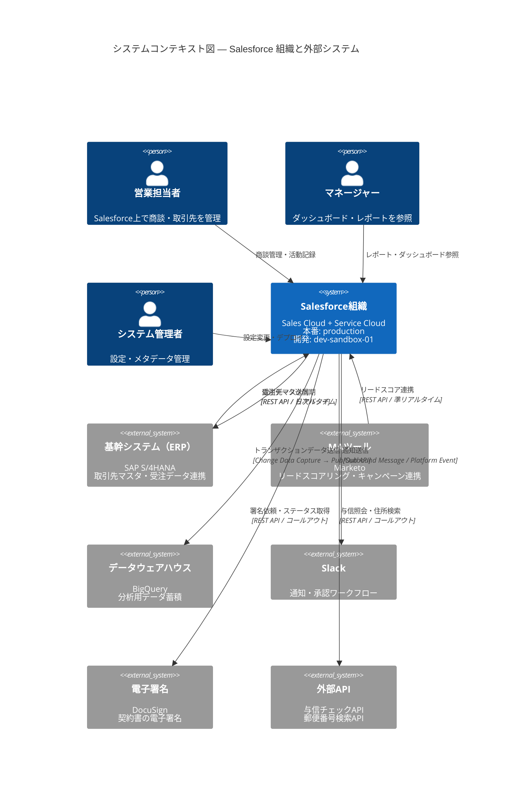
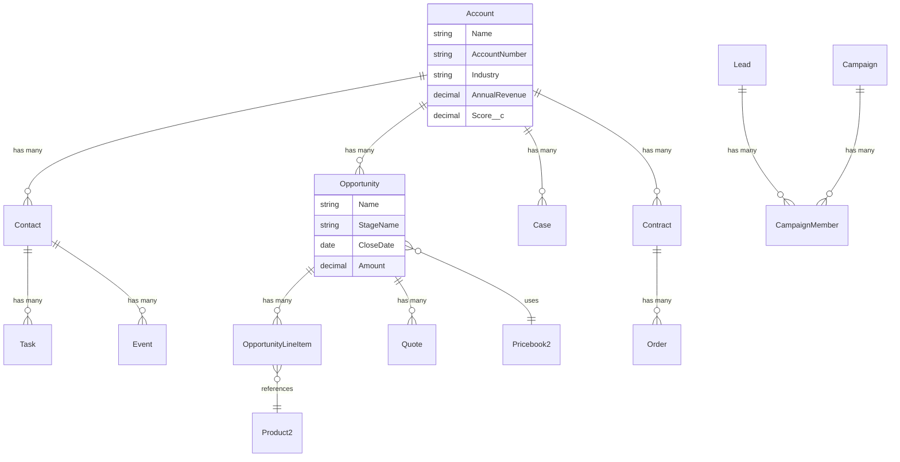
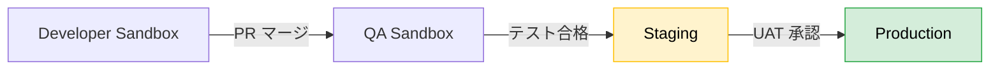

# システムコンテキスト図・連携マップ

> 最終更新: 2026-03-09
> 管理者: {チーム名}
> ステータス: 承認済み

---

## 1. システム全体像

本ドキュメントは、Salesforce組織を中心としたシステム連携の全体像を定義する。
すべての案件（`docs/projects/{PROJECT_ID}/`）は、ここに記載された連携マップとの整合性を保つこと。

### 1.1 コンテキスト図

### 1.2 連携一覧

| # | 連携先システム | 連携方式 | 方向 | 頻度 | 対象データ | プロトコル | 認証方式 |
|---|-------------|---------|------|------|----------|-----------|---------|
| INT-001 | 基幹システム（ERP） | REST API | 双方向 | リアルタイム + 日次バッチ | 取引先、受注 | HTTPS | OAuth 2.0 Client Credentials |
| INT-002 | MAツール（Marketo） | REST API | Marketo → SF | 準リアルタイム | リード、スコア | HTTPS | API Key |
| INT-003 | データウェアハウス | Change Data Capture | SF → BigQuery | リアルタイム | 商談、活動 | gRPC (Pub/Sub API) | JWT Bearer |
| INT-004 | Slack | Platform Event | SF → Slack | リアルタイム | 通知、承認依頼 | HTTPS | Bot Token |
| INT-005 | 電子署名（DocuSign） | REST API | 双方向 | ユーザー操作時 | 契約書 | HTTPS | OAuth 2.0 Auth Code |
| INT-006 | 与信チェックAPI | REST API | SF → 外部 | ユーザー操作時 | 与信スコア | HTTPS | API Key + HMAC |
| INT-007 | 郵便番号検索API | REST API | SF → 外部 | ユーザー操作時 | 住所情報 | HTTPS | API Key |

---

## 2. Salesforce 組織内部構成

### 2.1 主要オブジェクト関連図

### 2.2 自動化ロジック配置方針

| 自動化種別 | 用途 | 配置先 | 備考 |
|-----------|------|--------|------|
| Apex Trigger | ビジネスロジック（複雑な条件分岐、外部連携） | `force-app/main/default/triggers/` | 1オブジェクト1トリガ原則 |
| Flow | ノーコード自動化（項目更新、通知、簡易ロジック） | `force-app/main/default/flows/` | 管理者が保守可能な範囲に限定 |
| Platform Event | 非同期イベント駆動処理 | `force-app/main/default/` | 外部連携通知に使用 |
| Scheduled Apex | 日次/週次バッチ処理 | `force-app/main/default/classes/` | Batchable実装 |

---

## 3. 環境構成

### 3.1 環境一覧

| 環境名 | 種別 | 用途 | デプロイ方式 | URL |
|--------|------|------|------------|-----|
| production | 本番 | エンドユーザー利用 | CI/CD（GitHub Actions） | `https://{domain}.my.salesforce.com` |
| dev-sandbox-01 | Developer Sandbox | 機能開発 | `sf project deploy start` | `https://{domain}--dev01.sandbox.my.salesforce.com` |
| dev-sandbox-02 | Developer Sandbox | 機能開発（並行案件用） | `sf project deploy start` | `https://{domain}--dev02.sandbox.my.salesforce.com` |
| qa-sandbox | Partial Copy Sandbox | 結合テスト | CI/CD | `https://{domain}--qa.sandbox.my.salesforce.com` |
| staging | Full Copy Sandbox | UAT・本番リハーサル | CI/CD | `https://{domain}--staging.sandbox.my.salesforce.com` |

### 3.2 デプロイパイプライン

---

## 4. 非機能要件の概要

> 詳細は各 `policies/` ドキュメントを参照。

| カテゴリ | 方針 | 参照先 |
|---------|------|--------|
| セキュリティ | FLS 必須、共有ルールに基づくアクセス制御 | `policies/security-policy.md` |
| パフォーマンス | ガバナ制限遵守、バルク化必須 | `policies/performance-policy.md` |
| 外部連携 | Named Credential 必須、リトライ方針統一 | `policies/integration-policy.md` |
| エラーハンドリング | 統一例外ハンドリング、ログ記録必須 | `policies/error-handling-policy.md` |
| 命名規約 | PascalCase / camelCase 統一 | `policies/naming-convention-policy.md` |

---

## 5. 本ドキュメントの利用方法

### サブエージェントからの参照

| エージェント | 参照タイミング | 参照するセクション |
|------------|-------------|-----------------|
| `sf-requirements-analyst` | Phase 1（要件定義） | 連携一覧、オブジェクト関連図 |
| `sf-designer` | Phase 2（設計） | 全セクション |
| `sf-implementer` | Phase 3（実装） | 連携方式、環境構成 |
| `sf-code-reviewer` | Phase 5（レビュー） | 自動化配置方針、連携一覧 |

### 更新ルール

- 新しい外部連携が追加される場合は、必ず本ドキュメントを更新すること
- 更新時は ADR（`decisions/`）に判断根拠を記録すること
- 更新後はチームレビューを経て承認すること
